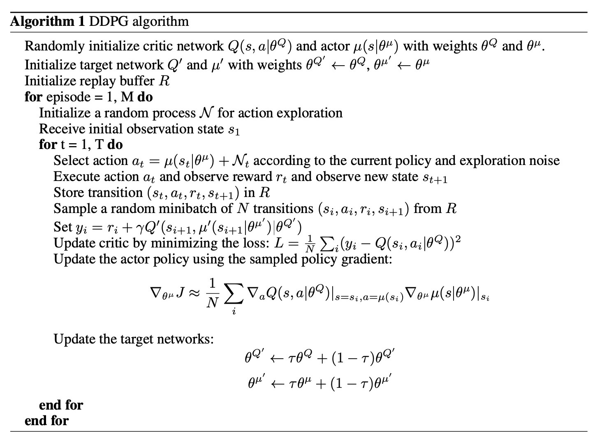
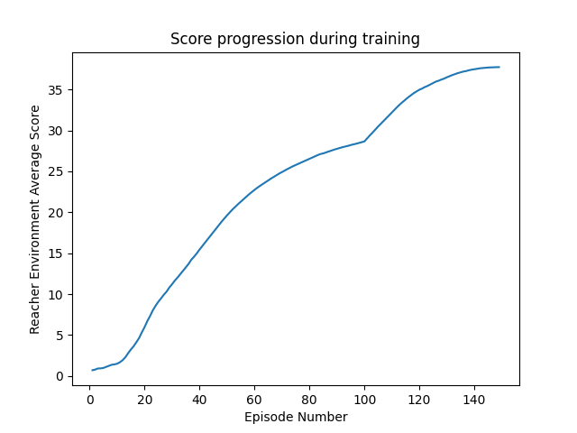

## Report Reacher Project
The goal of the reacher agent is to manipulate a double-jointed robotic arm to maintain its position 
inside the target area as long as possible. To solve the environment an average score >30.0 must be
achieved in 100 episodes.

### 1. Algorithm used

To solve the environment I used the Synchronous **Deep Deterministic Policy Gradient**. To implement 
DDPG I used [this paper](https://arxiv.org/abs/1509.02971) where the full
DDPG algorithm is explained in pseudocode form as follows:
 

Additional resources used:
- Udacity repository: DDPG pendulum project

### Environment details
This implementation concearns the unity reacher environment with 20 agents. This environment is responsible for 
providing the state, reward, next state and done flag once the episode is completed. 
Here, the characteristics of the environment are as follows:
- **State Size**: 33
- **Action Size**: 4 
  - Action value between: [-1, 1]
- **Number of Agents**: 20

### DNN designs used for DDPG
Both actor and critic DNNs are fully connected networks with the same number of layers but 
different sizes for the hidden layers. These designs are as follows:
- **Actor DNN**
  - Input Layer: 33 x 256 (+BatchNorm)
  - Hidden Layer: 256 x 128 (+BatchNorm)
  - Output Layer: 128 x 4
  - Activation Function (all layers): *Scaled Exponential Linear Unit (SeLU)* except last one: *tanh*
- **Critic DNN**
  - Input Layer: 33 x 512  (+BatchNorm)
  - Hidden Layer 1: 512 x 256 
  - Hidden Layer 2: 256 x 64
  - Output Layer: 64 x 1
  - Activation Function (all layers): *Scaled Exponential Linear Unit (SeLU)*
  
The optimizer used for training the DNNs is Adam with a learninng rate of 0.001.

### Agent Training
As recommended by the project description, we do not update and train the agents at every step,
but we choose to train them 10 times (using 10 random mini-batches out of the 
replay buffer) every 20 steps. This ensures the stability of training and prevents training from crashing after
some progress.
To train the agents Critic and Actor DNNs we take the following steps:

##### CRITIC TRAINING
1. Retrieve a *BATCH_SIZE* number of <S,A,R,S'> tuples randomly from the replay buffer
2. Get ACTOR_TARGET response to S' (NEXT_ACTIONS)
3. Get CRITIC_TARGET response to S' and NEXT_ACTIONS (Q_TARGET_NEXT)
4. Calculate Q_TARGET using Q_TARGET_NEXT as follows:
```
Q_TARGET = R+ gamma * Q_TARGET_NEXT
```

5. Get CRITIC_LOCAL response given S and A. (Q_EXPECTED)
6. Calculate the error between Q_EXPECTED and Q_TARGET
7. **TRAIN** the CRITIC_LOCAL by backpropagating this error.

####ACTOR TRAINING

- Get ACTOR_LOCAL response given S (ACTIONS)
- Get CRITIC_LOCAL response given S and ACTIONS (ADVANTAGE)
- **TRAIN** the ACTOR_LOCAL based on the minimization of the negative of the ADANTAGE. Thus, 
  performing gradient ascent.

Training stops when the agents achieve an average score higher than 30.0 for 100 consecutive episodes.

The DDPGAgent class is included in the **agent.py** file while the neural network designs used for the actor and the critic
are described in the **model.py** file. To train the agents we use the **train_agent.py** file.

###2. Results
Next, we train the agents until the average score of the last 100 episodes is more than 30. The progression of the 
score during training can be seen in the plot below.



The agent was able to solve the environment reaching an average score of 37.74, in 149 episodes
(Total time: 118 minutes)

#### Watch the trained agent below:


### 3. Future work
- Experimenting with the hyperparameters and identify the most impactful ones in order to fine tune them.
- Solving the environment using PPO, A2C and D4PG to practice on these techniques
- Solving the Crawler environment.